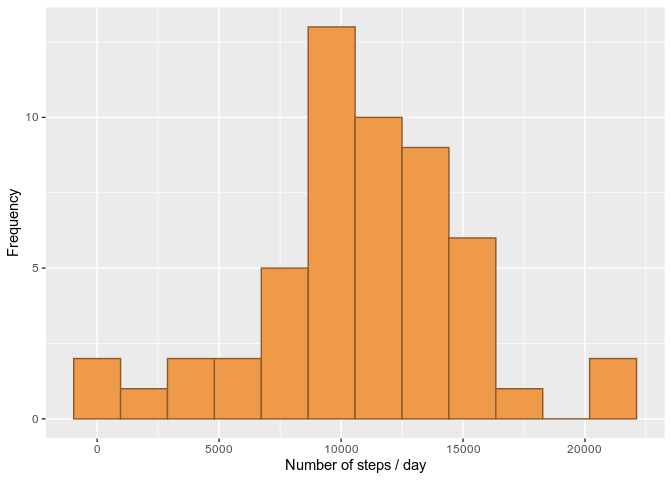
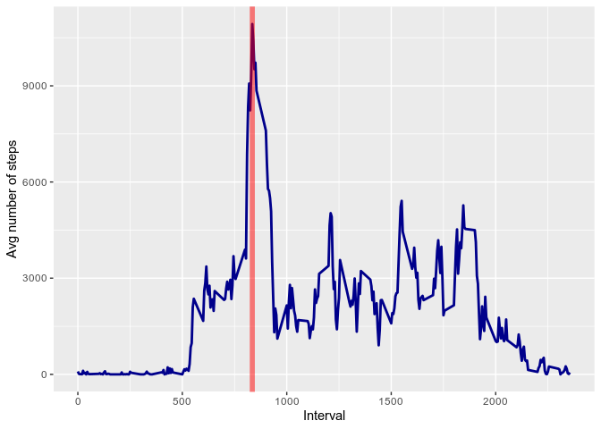
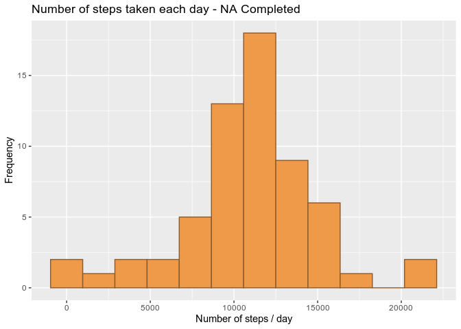
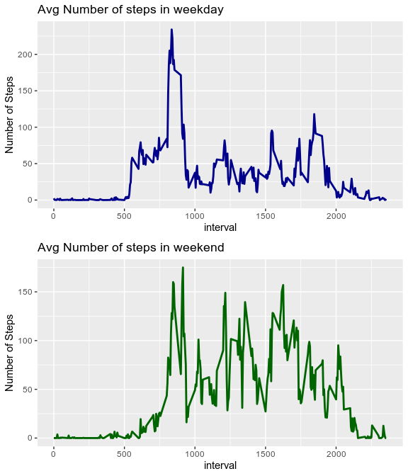

## Loading and preprocessing the data


```r
library(tidyverse)
library(dplyr)
library(ggplot2)
library(gridExtra)
```

1. Load the data (i.e. read.csv())


```r
if (!file.exists("activity.csv"))
    unzip(zipfile = "activity.zip", exdir = getwd())
```

2. Process/transform the data (if necessary) into a format suitable for your analysis


```r
activity <- as_tibble(read.csv("activity.csv"))
activity <- activity %>% mutate(date = as.Date(date, format = "%Y-%m-%d"))
str(activity)
```

```
## tibble [17,568 × 3] (S3: tbl_df/tbl/data.frame)
##  $ steps   : int [1:17568] NA NA NA NA NA NA NA NA NA NA ...
##  $ date    : Date[1:17568], format: "2012-10-01" "2012-10-01" ...
##  $ interval: int [1:17568] 0 5 10 15 20 25 30 35 40 45 ...
```


## What is mean total number of steps taken per day?

1. Calculate the total number of steps taken per day


```r
df_stepsbyday <- activity %>% group_by(date) %>% 
    summarise(Number_steps = sum(steps,na.rm = F))
```

2. Make a histogram of the total number of steps taken each day


```r
plot_nsteps <- ggplot(data=df_stepsbyday) +
    geom_histogram(aes(x=Number_steps),bins = 12, fill="tan2", colour="tan4") +
    xlab("Number of steps / day") +
    ylab("Frequency")

print(plot_nsteps)
```

<!-- -->

3. Calculate and report the mean and median of the total number of steps taken 
per day


```r
stepsbyday_mean <- as.integer(round(mean(df_stepsbyday$Number_steps,na.rm = T)))
stepsbyday_median <- as.integer(round(median(df_stepsbyday$Number_steps,na.rm = T)))
print(paste("Mean of the total number of steps taken per day: ", 
            stepsbyday_mean))
```

```
## [1] "Mean of the total number of steps taken per day:  10766"
```

```r
print(paste("Median of the total number of steps taken per day: ", 
            stepsbyday_median))
```

```
## [1] "Median of the total number of steps taken per day:  10765"
```

Mean of the total number of steps taken per day: **10766**

Median of the total number of steps taken per day: **10765**


Answer of question:

The mean total number of steps is 10766.

<br>
<br>
<br>


## What is the average daily activity pattern?

1. Make a time series plot (i.e. \color{red}{\verb|type = "l"|}type = "l") of 
the 5-minute interval (x-axis) and the average number of steps taken, averaged 
across all days (y-axis)


```r
df_stepsinterval <- activity %>% group_by(interval) %>%
    summarise(Number_steps = sum(steps,na.rm = T))

# Max 
result <- (df_stepsinterval %>% filter(Number_steps == max(Number_steps)))

plot_avgstepsinterval <- ggplot(data= df_stepsinterval) +
    geom_line(aes(x=interval,y=Number_steps),color="darkblue",size=1) +
    labs(x="Interval", y="Avg number of steps") + 
        geom_vline(aes(xintercept = result$interval), colour = "red", size=2,alpha=0.5)
plot_avgstepsinterval
```

<!-- -->


2. Which 5-minute interval, on average across all the days in the dataset, 
contains the maximum number of steps?


```r
result <- (df_stepsinterval %>% filter(Number_steps == max(Number_steps)))

print(paste("5-minute interval:",result$interval, "with", 
            result$Number_steps, "avg number of steps"))
```

```
## [1] "5-minute interval: 835 with 10927 avg number of steps"
```


**Answer of question:**

5-minute interval: 835 with 10927 avg number 
of steps.

<br>
<br>
<br>


## Imputing missing values

1. Calculate and report the total number of missing values in the dataset 
(i.e. the total number of rows with NAs)


```r
total_na_rows <- sum(sapply(activity, function(x) sum(is.na(x))))
print(paste("Total Number of rows with NA: ", total_na_rows))
```

```
## [1] "Total Number of rows with NA:  2304"
```

Total Number of rows with NA: **2304**


2. Devise a strategy for filling in all of the missing values in the dataset. 
The strategy does not need to be sophisticated. For example, you could use the 
mean/median for that day, or the mean for that 5-minute interval, etc.

**Strategy: Fill NA's with the mean value (rounded as int) of the interval**

*Create a Data Frame with the mean value of each time interval:*


```r
df_mean_nsteps <- activity %>% group_by(interval) %>%
    summarise(Mean_NumberSteps = round(mean(steps,na.rm = T)))
```


3. Create a new dataset that is equal to the original dataset but with the missing data filled in.

*First, I'll create a Function to receive the steps and interval. If Steps is NA
, return the mean of data frame create above, otherwise, return the original 
value of steps*


```r
get_mean_interval <- function(steps_int, interval_int){
    if (is.na(steps_int)){
        result <- filter(df_mean_nsteps,interval == interval_int)
        result <- result$Mean_NumberSteps}
    else result <- steps_int
    return(result)
}
```


```r
df_meanna <- activity %>% rowwise() %>% 
    mutate(steps = get_mean_interval(steps, interval))
summary(df_meanna)
```

```
##      steps             date               interval     
##  Min.   :  0.00   Min.   :2012-10-01   Min.   :   0.0  
##  1st Qu.:  0.00   1st Qu.:2012-10-16   1st Qu.: 588.8  
##  Median :  0.00   Median :2012-10-31   Median :1177.5  
##  Mean   : 37.38   Mean   :2012-10-31   Mean   :1177.5  
##  3rd Qu.: 27.00   3rd Qu.:2012-11-15   3rd Qu.:1766.2  
##  Max.   :806.00   Max.   :2012-11-30   Max.   :2355.0
```


3. Make a histogram of the total number of steps taken each day and Calculate 
and report the mean and median total number of steps taken per day. Do these 
values differ from the estimates from the first part of the assignment? What is 
the impact of imputing missing data on the estimates of the total daily number 
of steps?


```r
df_stepsbyday2 <- df_meanna %>% group_by(date) %>% 
    summarise(Number_steps = sum(steps))

plot_nsteps2 <- ggplot(data=df_stepsbyday2) +
    geom_histogram(aes(x=Number_steps),bins = 12, fill="tan2", colour="tan4") +
    labs(x="Number of steps / day",
         y="Frequency",
         title="Number of steps taken each day - NA Completed")

plot_nsteps2
```

<!-- -->


```r
stepsbyday_mean2 <- as.integer(round(mean(df_stepsbyday2$Number_steps,na.rm = T)))
stepsbyday_median2 <- as.integer(round(median(df_stepsbyday2$Number_steps,na.rm = T)))

print(paste("Mean of the total number of steps taken per day: ", 
            stepsbyday_mean2))
```

```
## [1] "Mean of the total number of steps taken per day:  10766"
```

```r
print(paste("Median of the total number of steps taken per day: ", 
            stepsbyday_median2))
```

```
## [1] "Median of the total number of steps taken per day:  10762"
```


**Answer of question:**

Mean of the total number of steps taken per day 
(NA Removed): **10766**

Mean of the total number of steps taken per day 
(NA Filled wit mean in interval): **10766**

Median of the total number of steps taken per day 
(NA Removed): **10765**

Median of the total number of steps taken per day 
(NA Filled wit mean in interval): **10762**


**There isn't relevant changes in the Mean and Median between 2 DF's using the strategy to Fill NA's**


<br>
<br>
<br>


## Are there differences in activity patterns between weekdays and weekends?


1. Create a new factor variable in the dataset with two levels – “weekday” and 
“weekend” indicating whether a given date is a weekday or weekend day.


```r
weekend = c('Saturday','Sunday')
df_activity_week <- activity  %>% mutate(week=weekdays(date)) %>% 
    mutate(week=if_else(week %in% weekend,"weekend","weekday"))
df_activity_week$week <- as.factor(df_activity_week$week)
str(df_activity_week)
```

```
## tibble [17,568 × 4] (S3: tbl_df/tbl/data.frame)
##  $ steps   : int [1:17568] NA NA NA NA NA NA NA NA NA NA ...
##  $ date    : Date[1:17568], format: "2012-10-01" "2012-10-01" ...
##  $ interval: int [1:17568] 0 5 10 15 20 25 30 35 40 45 ...
##  $ week    : Factor w/ 2 levels "weekday","weekend": 1 1 1 1 1 1 1 1 1 1 ...
```

```r
#activity %>% mutate(week=pmap())
```


2. Make a panel plot containing a time series plot (i.e. type = "l") of the 
5-minute interval (x-axis) and the average number of steps taken, averaged 
across all weekday days or weekend days (y-axis). See the README file in the 
GitHub repository to see an example of what this plot should look like using 
simulated data.

<br>
<br>
<br>
Note: I have used ggplot instead of lattice to keep the standard in the document.
It is allowed as original Assessment git Readme:

*...you can make the same version of the plot using any plotting system you choose.*


```r
df_activity_week_AvgSteps <- df_activity_week %>% group_by(week, interval) %>% 
    summarise(avg_steps = mean(steps,na.rm = T))

# Plot of weekday
plot_weekday <- ggplot(data=filter(df_activity_week_AvgSteps,week=="weekday")) +
    geom_line(aes(interval,avg_steps),color="darkblue",size=1) +
    labs(x="interval",
         y="Number of Steps",
         title="Avg Number of steps in weekday")

# Plot of Weekend
plot_weekend <- ggplot(data=filter(df_activity_week_AvgSteps,week=="weekend")) +
    geom_line(aes(interval,avg_steps),color="darkgreen",size=1) +
    labs(x="interval",
         y="Number of Steps",
         title="Avg Number of steps in weekend")


grid.arrange(plot_weekday, plot_weekend, ncol = 1)
```

<!-- -->


**Answer of question:**

Yes. in the weekend we can see more movement during the afternoon compared 
with weekday and the movement starts progressively during the morning

<br>
<br>
